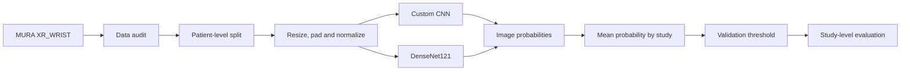

<div align="center">

# Wrist X-ray Abnormality Classification

**Study-level normal vs. abnormal classification of wrist radiographs using the MURA dataset**


</div>

---

## Overview

This project develops a reproducible deep-learning pipeline that classifies a wrist X-ray **study** as either **normal** or **abnormal**. It compares a custom convolutional neural network with an ImageNet-pretrained DenseNet121 and evaluates both under the same patient-level data protocol.

> **Scope:** MURA provides normal/abnormal study labels. This project does not claim to identify a specific fracture or diagnose an abnormality subtype.

## Project at a glance

| Item | Selection |
|---|---|
| Dataset | MURA-v1.1 |
| Anatomy | Wrist (`XR_WRIST`) |
| Task | Binary classification: normal / abnormal |
| Prediction level | Study level |
| Baseline | Custom small CNN |
| Main model | Pretrained DenseNet121 |
| Initial input | 224 x 224, aspect ratio preserved and padded |
| Input channels | Grayscale replicated to 3 channels |
| Split unit | Patient |
| Primary metric | Macro F1 |
| Clinical metric | Abnormal sensitivity |

## Pipeline



Multiple images may belong to one MURA study. The model predicts each image independently, then image probabilities are averaged within `study_uid` to obtain the final study-level probability.

## Evaluation protocol

- Only `XR_WRIST` studies are included.
- The official MURA training set is divided into internal train and validation sets at **patient level**.
- Every image and study from the same patient remains in exactly one split.
- The official MURA validation set is reserved as the **locked final test set**.
- Model choice, early stopping, and threshold selection use internal validation data only.
- The locked test set is evaluated only after the model and threshold are frozen.

Reported study-level metrics:

- Macro F1
- Abnormal sensitivity
- Specificity
- ROC-AUC
- PR-AUC
- Cohen's kappa
- Confusion matrix

## Repository structure

```text
.
|-- .github/
|   `-- pull_request_template.md
|-- configs/
|   |-- data.yaml
|   |-- baseline.yaml
|   `-- densenet121.yaml
|-- data/
|   |-- manifests/
|   `-- README.md
|-- docs/
|   |-- TEAM_WORKFLOW.md
|   |-- GPU_GUIDE.md
|   |-- decisions.md
|   `-- experiment_registry.csv
|-- presentation/
|-- report/
|-- scripts/
|-- src/
|   |-- data/
|   `-- models/
|-- tests/
|-- .env.example
|-- .gitignore
|-- CONTRIBUTING.md
|-- requirements.txt
`-- run_all.py
```

## Getting started

### 1. Clone the repository

```bash
git clone https://github.com/Medical-Xray-AI/wrist-abnormality.git
cd wrist-abnormality
```

### 2. Configure local paths

Copy the environment template:

```bash
# Windows CMD
copy .env.example .env

# Linux/macOS
cp .env.example .env
```

Edit `.env` and point it to the extracted dataset and a machine-local output directory:

```env
XRAY_DATA_ROOT=/path/to/MURA-v1.1
XRAY_OUTPUT_ROOT=outputs
XRAY_NUM_WORKERS=4
```

The real `.env` file must remain local and must never be committed.

### 3. Check the GPU environment

Before installing or upgrading PyTorch on the shared GPU server, follow [`docs/GPU_GUIDE.md`](docs/GPU_GUIDE.md). The dependency list is provisional until the server's Python, CUDA, PyTorch, and torchvision versions have been audited.

### 4. Verify the repository entry point

```bash
python run_all.py --check
```

The complete training and inference commands will be connected to `run_all.py` as the reviewed modules are integrated.

## Dataset

Download MURA only from the approved source and extract it outside the Git repository. The directory referenced by `XRAY_DATA_ROOT` is expected to contain:

```text
MURA-v1.1/
|-- train/
|-- valid/
|-- train_image_paths.csv
|-- train_labeled_studies.csv
|-- valid_image_paths.csv
`-- valid_labeled_studies.csv
```

See [`data/README.md`](data/README.md) for the data policy and [`data/manifests/README.md`](data/manifests/README.md) for the manifest contract.

Official resources:

- [MURA dataset and benchmark](https://stanfordmlgroup.github.io/competitions/mura/)
- [MURA research paper](https://arxiv.org/abs/1712.06957)

## Reproducibility

Every meaningful experiment must record:

- Git commit SHA
- Config file and random seed
- Split version
- Device and peak GPU memory
- Training duration and best epoch
- Validation metrics
- External checkpoint location

Runs are tracked in [`docs/experiment_registry.csv`](docs/experiment_registry.csv). Large outputs and checkpoints remain outside Git.

## Team workflow

Development is branch- and pull-request-based. Direct development on `main` is avoided after the initial bootstrap, and each pull request requires at least one teammate review.

- [Team roles and integration gates](docs/TEAM_WORKFLOW.md)
- [Contribution and review rules](CONTRIBUTING.md)
- [Technical decision log](docs/decisions.md)

## Project status

- [x] Repository structure and security rules
- [x] Shared data and experiment configurations
- [x] Team workflow and GPU guidance
- [ ] Dataset audit and patient-level manifests
- [ ] Custom CNN baseline
- [ ] DenseNet121 training pipeline
- [ ] Study-level evaluation and interpretation
- [ ] End-to-end inference and clean-clone verification
- [ ] Final report and presentation

## Security and data policy

Do **not** commit raw X-rays, processed datasets, patient information, model checkpoints, `.env` files, VPN configurations, private keys, Jupyter tokens, or Kaggle credentials.

## Disclaimer

This repository is an educational research project. Its outputs are not validated for clinical use and must not be used for medical diagnosis or treatment decisions.
